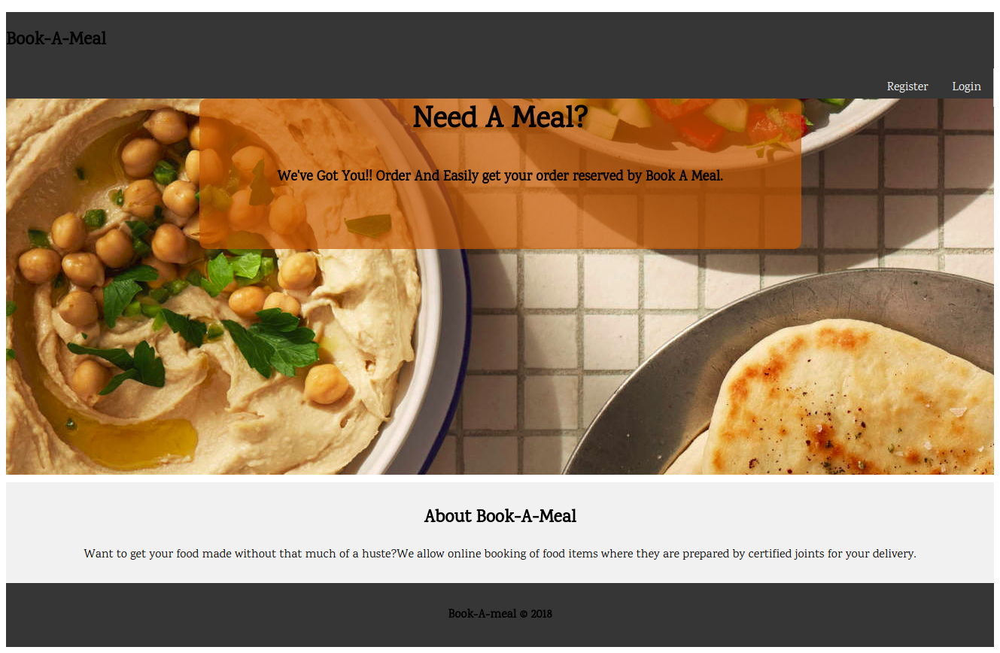

# Book a Meal

The site is for online meal booking for users and meal management for the caterers.
1-The User Interface.
  -A home page for new visitors to the site.
  -Users and Caterers should be able to sign up and log in.
  -Users login in to a view menu page where they can make an order of modify it.
  -Caterers should login to the manage page where they should manage meal options.
  -Caterers can view all orders in summary or an order in more details.
  -Caterers can set menu for a specific day basing on available meals from the day.

Git pages :

  

The link for this projects UI can be found at:https://chepmanu.github.io/book_meal/

#API endpoints.
1-Sign up endpoint. User provides credentils using a post request.
2-Sign in endpoint. User provides the required credentials and also the token asigned to them for verification.Only correct credentials allowed for a successfull login.
3-Get meals endpoint.Returns a list of meals for an authenticated user and who should be an admin.
4-Post meals endoint. Allows for a meal to be posted by an authenticated admin.
5-Mordify meals endpoint-Allows for a meal to be updated by an authenticaqted admin.
6-Delete meal endpoint.Allows for  a meal to be deleted by an authenticated admin.
7-Post menu endpoint.Allows for an admin to post the menu for a particular.
8-Get menu endpoint. Allows for authenticated users to view the day's menu.
9-Post Orders endpoint. Allows for an authenticated user to post orders from the menu.
10-Mordify endpoint. ALlows for an authenticated user to mordify a previously ordered meal.
11-Get orders endpoint.Allows for an authenticated admin to get all the day's orders.

#How to run the app
1-Set up a virtual environment.
2-Pip install flask and jwt.
3-Import werkzeug.
4-Import datetime.
4-Pip install nose test .
5-Cd run the tests.
5-Use postman to practically use the endpoints.

